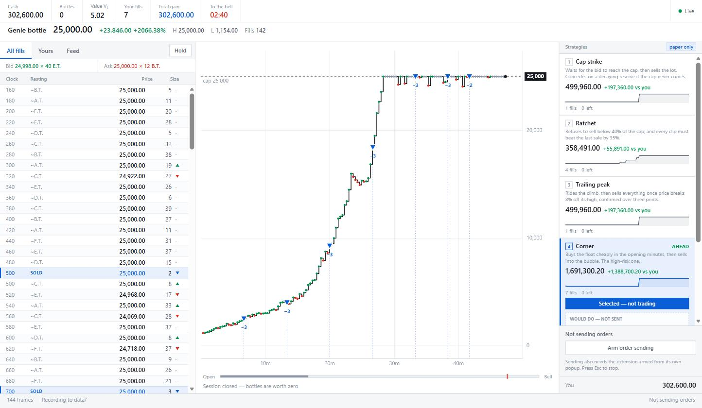

# FIN11: Genie bottles

A live viewer for the NHH FIN11 trading sessions. It shows every filled trade as it
prints, draws a price curve that gains one point per fill, and runs three strategies
side by side on paper so you can see which one is winning. Any of them can be armed to
trade for real, behind two switches and a kill key.


<sub>Synthetic test data. The trader names are invented.</sub>

```powershell
.\scripts\start.ps1
```

Opens in its own window. Load `extension\` once from `chrome://extensions` (Developer
mode, then Load unpacked), and trade in your normal browser as usual.

## The game

The class trades one made-up asset against each other for 50 minutes. You start with
about 20 bottles and no cash. At the bell, bottles are worth **nothing**:

```
total gain  =  cash  +  realized utility  +  0 × bottles
```

So the whole thing is a race to sell your endowment into the bubble before everyone
else does.

## Results

| Session | Rank | Cash at close | Bottles left |
|---|---|---|---|
| #1, 18 Aug 2026 | 14th of ~40 | 161,859.60 | 0 |
| #2 | | | |
| #3 | | | |

Session 1: I finished flat, which was right, but sold in clips too small for a market
that kept running to the 25,000 cap. Rank is from memory, worth re-checking.

---

<details>
<summary><b>Reading the screen</b></summary>

- **Fills tape.** Every trade, newest first. The arrow carries the tick direction and
  comes off the server's `lastTick` field. Nothing else in the tape is coloured.
- **Yours.** Blue, and mixed into the same stream, so you never switch tabs to see what
  you just did.
- **Resting.** The server never names the parties to a trade, but it does identify
  whoever sits on top of the book, so this column shows who was resting at the price
  that printed. The `~` marks it as an inference.

  **Shown as initials only.** Classmates' full names are not ours to put on a screen
  that gets screenshotted, so the viewer reduces them and the local log keeps the
  original. Nothing identifying anyone has ever been committed to this repository.
- **Session bar.** How much of the 50 minutes has gone, with a red mark for where you
  should already be flat.

**It cannot place orders.** It never touches the page's `mSubmitBid` or `mHitAsk`
functions, so it also cannot trigger the blocking `alert()` that makes automating this
site risky. A test asserts those names appear nowhere in the injected code.

</details>

<details>
<summary><b>The strategy panel</b></summary>

Three strategies run all session on their own paper portfolios, seeded from your real
account at the open and scored on the formula the class is ranked by.

They are built around what Session 1 actually did. From the captured book: the market
pinned at the 25,000 cap from **minute 19.6** onward and was still there nine minutes
later when the capture ended, with a bid for **8,687 bottles** sitting at the cap.
Liquidity was never the constraint. The realised average that day was 8,093 a bottle
against 25,000 available for ten minutes straight.

So the mistake was not being late to the exit. It was selling cheap into a market
pinned at its own hard maximum. That gives one rule that needs no market reading at
all: **25,000 is enforced by the server, so no higher price can ever print.** Once the
best bid touches it, holding has no upside left and a retreating bid is a real risk.
All three strategies share that rule and differ only on the way up.

| | what it does | best when |
|---|---|---|
| **1 Cap strike** | Waits for the bid to reach the cap, then sells the lot. Parks an ask under the cap meanwhile. | the market pins at the ceiling, as it did in Session 1 |
| **2 Ratchet** | Won't sell below 40% of the cap; each clip must beat the last sale by 35%. | you want a rising average price and no single timing call |
| **3 Trailing peak** | Rides the climb, leaves on an 8% break confirmed over three prints. | the bubble breaks before the bell |
| **4 Corner** | Buys the float cheaply in the opening minutes, then sells into the bubble. | the bubble repeats. It loses money if it does not |
| **5 Sniper** | Takes crossed books: buys the offer and sells the bid at once. | almost never, see below |

Press **1–5** to switch, **0** to clear. Switching while armed disarms.

All five seed at the opening bell on the standard hand and run every tick from there,
so the comparison covers the whole session rather than starting whenever you opened the
window. They share three rules: sell everything once the bid reaches the cap, be flat
before the bell, and concede on a reserve price that decays to zero as the clock runs
out.

### Results by session

After every session, replay its capture through all five and add a row:

```powershell
node scripts\backtest.js data\raw-<timestamp>.jsonl
```

The question across sessions is whether one strategy is *always* on top, or whether the
winner just tracks the shape the market happened to take. **One session's winner is noise.**

| Session | Date | Coverage | Mine | Cap strike | Ratchet | Trailing peak | Corner | Sniper | Winner |
|---|---|---|---|---|---|---|---|---|---|
| **1** | 18 Aug 2026 | ⚠️ 23% | 161,860 | 499,980 | 494,985 | 499,980 | 499,980 | 500,030 | — |
| **2** | | | | | | | | | |
| **3** | | | | | | | | | |

**Session 1 does not rank anything, and the capture is why.** It covers game clock
1839→1289, session minutes **19.4 to 28.5** — about 23% of the session. A page reload
around minute 42 wiped an in-memory buffer, taking the last 21 minutes with it, and the
first 19 were never recorded at all.

So the file starts with the market already at 24,000 and pinned there. It measures the
exit and nothing else, which is why every strategy lands within 1% of the others and why
all of them beat the 8,093 a bottle realised on the day. That gap is the real lesson from
Session 1; the ordering above is not.

That failure cannot recur: the hub writes every message to disk on arrival and the
extension re-attaches on reload. Start the hub **before** the session opens, or the
strategies seed late and the comparison is short again.

### How the shapes change the ranking

Simulated sessions separate them where the real capture could not:

### The corner, and why it is bounded

Cornering cannot create demand here. Bottles pay zero at the bell and `Vt` is about 2, so
nobody ever *needs* to buy them from you; squeezing the supply just leaves you holding
it. The reason to do it anyway is that Session 1 ran to the ceiling, and inventory bought
cheaply beforehand is worth a lot into that.

Its discipline is arithmetic, not taste. A bid at X only pays if you can sell above X,
and nothing above 25,000 can ever print, so buying near the ceiling is buying with no
upside left. Hence a hard buy ceiling at 30% of the cap, a 70-bottle limit, and bids that
improve the market by one step rather than leaping above it — leap, and you become the
only buyer, everyone dumps on you, and you finish holding worthless bottles with the cash
gone.

### Arbitraging other people's mistakes

Measured before it was written, on the captured book:

- **5** strictly crossed moments in 1,403 book states, worth **794** in total, largest
  single edge **1**
- **zero** offers more than 10% below the last trade, **zero** bids more than 10% above
- median spread **0** — with the market at the ceiling and a 0.01 tick, there is no room
  left to be wrong in

And the risk is one-sided: profit is 1 a bottle when both legs fill, the loss is the full
24,999 when the sell leg misses, because what you are left holding pays nothing at the
bell. That needs a **99.996%** fill rate to break even. Backtested on the real capture,
Sniper earns **50** more than simply exiting well.

It exists so the question is answered with a number rather than a hunch, and to catch a
genuinely fat mistake if a later session is more volatile. It is not where the money is.

<sub>A caution learned building this: an early synthetic generator moved price 3.5% per
quote and updated the bid before the ask, manufacturing a crossed book on every single
tick. Sniper "earned" 199 fills against the 5 that exist in real data. A backtest will
happily generate the opportunity you are testing for.</sub>

**The fill model is deliberately pessimistic.** A taking order fills at the quoted price
and only for the size quoted. A resting order fills only when a print goes *through* its
price, never merely at it, because at your own price you are behind the queue that was
already there. It also cannot model queue position or your own market impact, so use the
panel to rank strategies against each other rather than to predict your actual take.

Clicking a card selects it and shows what it would do right now. Selecting alone sends
nothing; see below for what it takes to actually place orders.

</details>

<details>
<summary><b>Placing orders</b></summary>

Off by default, and it takes two switches to turn on:

1. **In the viewer**, select a strategy and click Arm twice (the second click confirms).
   Lasts 10 minutes, then disarms itself.
2. **In the extension popup**, click Arm order sending.

Both have to be on. Either one off means nothing leaves the machine, so a bug on one
side cannot trade by itself. Press **Esc** in the viewer to stop instantly.

**It sends the WebSocket message the page itself sends**, not `mSubmitAsk` or `mHitBid`:

```
{ header: 'sell', isno: 1, price: '25000', qty: '20' }
```

Those two functions are DOM wrappers, and every one of their error paths calls `alert()`.
A blocking dialog freezes the page and everything attached to it, which is why the bot
was never armed after Session 1. Reading their source shows the alerts live only in the
wrapper: the order itself is one line of JSON on the socket. Going direct removes the
dialog risk and the dependency on the `#mQty` field, which was never validated.

Refused, always:

- selling more than is held, or buying above 35% of the cap
- buying past an 80-bottle position
- a price above the cap, off the tick, or not a number
- hitting your own bid (the page's own check, reimplemented since we skip its DOM)
- more than 40 in one order, or more than 60 orders in an armed session
- anything at all when the position is unknown

It disarms itself on: the 10-minute window lapsing, the session ending, the order limit,
any order failing, the strategy throwing, or the hub going away. Cancels are exempt from
rate limiting so they can never be the order that gets dropped, and taking the cap or
beating the bell runs in its own lane so a routine order cannot starve it.

Every order is logged to `data/` before and after it is sent.

</details>

<details>
<summary><b>Running it without a live market</b></summary>

```powershell
.\scripts\start.ps1 -Replay ..\Downloads\genie_orderbook_full.json -Speed 30
```

Replays the captured Session 1 data. Against a running hub, `node scripts\smoke.js`
feeds a synthetic session that includes fills of your own.

Before a real session, run it once against the live B02 demo market ("Connect to B02
Demo" on the FTS site). That is the only check that exercises the real feed end to end,
and it touches nothing in the ranked competition.

</details>

<details>
<summary><b>How the capture works</b></summary>

The protocol came from reading the FTS client source rather than from guessing at
captured traffic.

**The socket is an implicit global.** The page runs `ws = new WebSocket(url)` with no
`var` in scope, so it lands on `window`. It only appears once you click connect, and it
gets replaced on reconnect. The extension patches the `WebSocket` constructor at
`document_start` instead, catching every socket the page opens.

**Frames arrive batched.** `onmessage` receives a JSON *array* of messages. A listener
that assumes a single object drops most of the feed.

| header | carries |
|---|---|
| `lasttrade` | price, size, and `lastTick`, the tick direction |
| `bestbid` / `bestask` | price, size, and `displayName`, the only place traders are identified |
| `cash` / `endow` | your money and your position, pushed on every change |
| `info` | your private value `Vt` |
| `time` / `startperiod` | the game clock, and the session length |

**The server never sends your own fills.** No inbound fill message, no blotter in the
page. The hub reconstructs each fill from the deltas: `Δposition` gives the size,
`Δcash ÷ Δposition` gives the price. Those two legs arrive separately, so the hub waits
for both. Pricing off the first leg alone gives you zero.

</details>

<details>
<summary><b>Layout and tests</b></summary>

```
hub/          receives the feed, records it, serves the viewer
  strategies/   paper portfolios and the fill model
  execution.js  arming, order validation, the outbound queue
extension/    captures the market feed, and (only when armed) sends orders
  execute.js    the one file that can place an order
ui/           the viewer window
scripts/      launcher, a synthetic feed, and the backtester
data/         recorded sessions (git-ignored: these identify real classmates)
```

The hub writes every message to `data/raw-<timestamp>.jsonl` the moment it arrives,
before anything parses it. A page refresh wiped an in-memory buffer in Session 1 and
cost the last 21 minutes: the top, the crash, the close.

```powershell
npm test
```

No dependencies. Node 20+.

</details>
